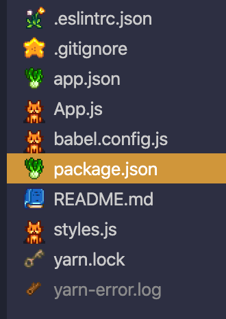

# VSCode Stardew Icon Theme

A Stardew Valley themed product icon pack!
Currently for common front-end web development file types




Download at https://marketplace.visualstudio.com/items?itemName=klyap.vscode-stardew-icon-theme

## Development

This extension uses image files directly from the `icons` folder in `icons.json`.

Open this repo in VSCode and hit F5 to test it out.

You will need to run to develop:
```yarn install```
```yarn install -g vsce```

### To publish a new version to the VS Code Extension Marketplace
Update the version number in package.json and run:
```vsce publish```

### To package for sharing with others
Run this command to generate a VSIX file:
 ```vsce package```
To load this VSIX extension into your VS Code IDE, replacing the file name with the generated one:
```code --install-extension vscode-stardew-icon-theme-0.0.3.vsix```

## Resources

Icons from https://stardewvalleywiki.com/Stardew_Valley_Wiki


